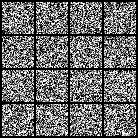

Title: Diffusion Transformer from scratch
Date: 2026-04-21
Category: Technical
Tags: models, research
Author: Le Tuan Huy (Tony) Nguyen
Summary: Custom implementation of Diffusion Transformer from scratch

# Diffusion Transformer from scratch

In my journey of understanding the state of the art in end to end robotic policy training, I found a very very common paradigm that a lot of research labs have converted to which is to pivot towards diffusion-based models to model action chunks for robots to perform (1, 2). Many of you reading are probably familiar with diffusion models in the context of image generation, and robot training policies are merely borrowing these same architectures. Initially, diffusion models were CNN based, but with the rise of transformers, they have found their way to sneak in as well: Enter the Diffusion Transformer. I have bestowed upon myself the task of reimplementing the paper that has introduced this architecture: Scalable Diffusion Models with Transformers (4). In this paper, they showed that Diffusion Transformers had scalability properties and outperformed all prior diffusion models. For this implementation, I will be staying within the image generation space. (Pi0 implementation coming soon!)

The implementation of Diffusion Transformer will be split into its constituent parts as PyTorch modules and then assembled as one DiT module. The parts consist of: Patchify, Conditioning Embeddings, DiT Block with adaLN-Zero, and output projection layers.

However, the paper does not include the VAE that compresses the original image into a latent representation and instead opts into using a frozen pretrained VAE. This VAE allows the Diffusion Transformer to work in a smaller dimension, which reduces computational costs and makes training efficient.

All of the code can be found at [https://github.com/NLTuan/diffusion-transformer](https://github.com/NLTuan/diffusion-transformer)

All credits go to the original authors' repo that contains compact and readable code that I blatantly stole from. Check them out here: [https://github.com/facebookresearch/dit](https://github.com/facebookresearch/dit)

# Patchify
In order for Transformers to operate on images, we need to ensure that the images are of the shape that Transformers love, which look like a sequence of tokens with an embedding/hidden dimension (e.g. `(batch, seq_len, dim)`). However, images are of the shape `(batch, channels, height, width)`. This can be changed by applying a `Conv2d` layer followed by a `reshape`. The `Conv2d` layer allows us to regroup squares of pixels into patches which get treated like tokens later on in the attention operations. Also, it allows for variable patch sizes, bigger patches will yield less "tokens", thus reducing compute complexity. For example, for a latent of shape `(4, 32, 32)`, a patch size of `2`, a `Conv2d(4, 1152, patch_size, patch_size)`, passing the latent through the convolutional layer yields an output of shape `(4, 1152, 16, 16)`. This is not the desired shape yet, and a `reshape` operation must be applied. Calling `einsum.reshape(latent, 'b d h w -> b (h w) d')` flattens the height and width dimension and puts the hidden dimension to the end, yielding something similar to that of an embedded token sequence. Now, this transformed latent representation can undergo attention operations, with image patches that perform bidirectional attention on one another.

# Conditioning Embedding

The diffusion model is conditioned by 2 things: the noise timestep and the text label. It is important to turn these into the right shapes before feeding them into the DiT block later on to condition the block output. The noise timestep is of shape `(1, B)`, a 1D vector of timesteps per batch item. The text label is `(1, B)`, one text label per batch item. It is important to note that in this specific paper, the DiT is trained on ImageNet, which has categorical labels instead of free text strings like in popular diffusion models. The timesteps and labels are embedded differently. The paper authors have stated that the embedding methods have been taken from ADM (3).

*Labels*: The labels are embedded with a learned embedding table. It is also implemented in a manner that allows for Classifier-Free Guidance, where some labels are dropped and assigned to a "Label-Free" generic label. By stripping the label from the prediction, this helps the diffusion model generalize.

*Timesteps*: (Apologies in advance for my attempt at explaining this in English :( ) They are embedded differently than categorical data types that simply index into a table. Timesteps in this case can be fractional and a different method is used. A variant of sine-cosine embedding is used. Key differences include the timesteps being multiplied to the arguments of the sine and cosine, and the sines and cosines aren't interleaved but instead concatenated along the hidden dimension. Also, this sine-cosine layer operates at a different dimension than the embedding dimension of the model, and a projection layer is applied at the end to return to the model dimension. In a sense, it is a combination of sin-cos embeddings and learned embeddings.

# DiT Block
The DiT block is architecturally identical to the standard Transformer block, with the exception of the conditioning mechanism. I will not dive deep into the attention and the feedforward network as there are a multitude of guides out there already that explain them in depth with competence. Seriously, the transformer could be its own blog post series and I will leave that as an exercise to the reader ;-). In addition to the regular transformer, there are conditioning layers that allow us to inject the timestep and label embeddings that we previously created into the transformer block, steering the output to be conditioned by the timestep and label. The technique used is adaptive layer normalization (adaLN) with zero initialization (makes it adaLN-Zero). The condition embeddings are projected into a dimension of `6 * dim` and then chunked into 6 variables: `gamma_1`, `gamma_2`, `beta_1`, `beta_2`, `alpha_1`, `alpha_2`. These variables are then used to scale and shift the output of the transformer block. The scale-shift with `gamma` being the scalar and `beta` being the shift happens before every Multi-Head Attention and FeedForward operation. Another scale operation with `alpha` is applied after the self-attention and feedforward operations. The zero part in adaLN-Zero comes from the zeroing of the projection MLP weights (the `6 * dim` projection one). The adaLN-Zero method is chosen by the authors over cross-attention and simply concatenating the embeddings since they have found it to work best in terms of performance in FID score and compute-efficiency. 

# Output Projection and Unpatchify
This part is responsible for converting the transformer outputs back into the image shape. A final layer applies a projection from the hidden size to `patch_size * patch_size * out_channels` which gets transformed into `(B, C, H, W)` in the unpatchify layer. With the final output, it is then possible to compute the loss as it is the same shape as the initial image.

# Putting It All Together
Chaining all of these components together yields the Diffusion Transformer! It accepts an image/latent and produces a noise prediction (or a velocity field if you're using a flow matching objective).

# Training & Sampling
I think the training and especially sampling deserves its own blog post because of its high complexity (or my lack of clarity!). Stay tuned for DDPM/DDIM vs Flow Matching. However, I was able to produce quite meaningful results training on MNIST and CIFAR10. MNIST is the GIF at the beginning of the blog post and a ~6.5 million parameter model was trained for 6 epochs. 

# Conclusion
I have learned a lot from trying to implement this architecture from scratch. Embedding the inputs and conditioning were things I have not worked on before coming from an LLM background. Otherwise, I am surprised at how many similarities there are between this and the CNN diffusion model in terms of training and architectural similarities with LLMs.

# References

[1] Black, K., Brown, N., Driess, D., Esmail, A., Equi, M., Finn, C., Fusai, N., Groom, L., Hausman, K., Ichter, B., Jakubczak, S., Jones, T., Ke, L., Levine, S., Li-Bell, A., Mothukuri, M., Nair, S., Pertsch, K., Shi, L.X., Tanner, J., Vuong, Q., Walling, A., Wang, H., & Zhilinsky, U. (2024). π0: A Vision-Language-Action Flow Model for General Robot Control. *ArXiv, abs/2410.24164*.

[2] Chi, C., Feng, S., Du, Y., Xu, Z., Cousineau, E., Burchfiel, B., & Song, S. (2023). Diffusion policy: Visuomotor policy learning via action diffusion. *The International Journal of Robotics Research, 44*, 1684 - 1704.

[3] Dhariwal, P., & Nichol, A. (2021). Diffusion Models Beat GANs on Image Synthesis. ArXiv, abs/2105.05233.

[4] Peebles, W.S., & Xie, S. (2022). Scalable Diffusion Models with Transformers. *2023 IEEE/CVF International Conference on Computer Vision (ICCV)*, 4172-4182.